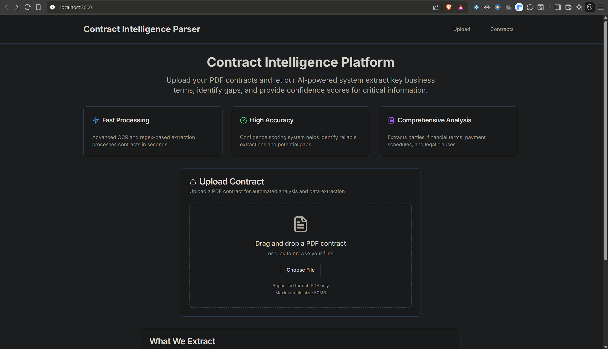
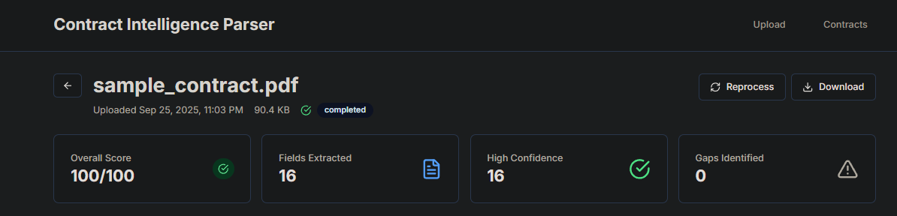
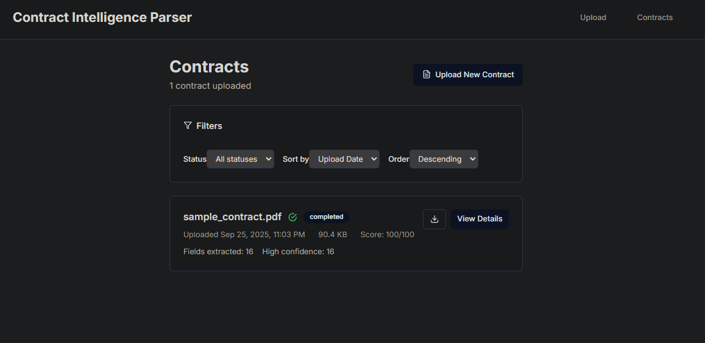
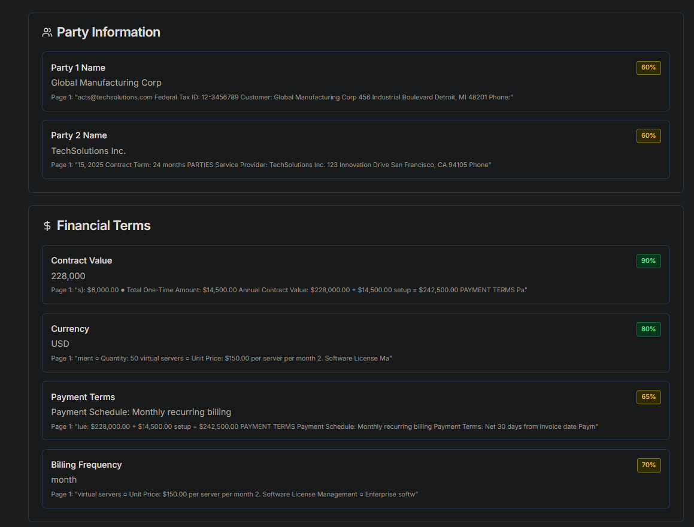
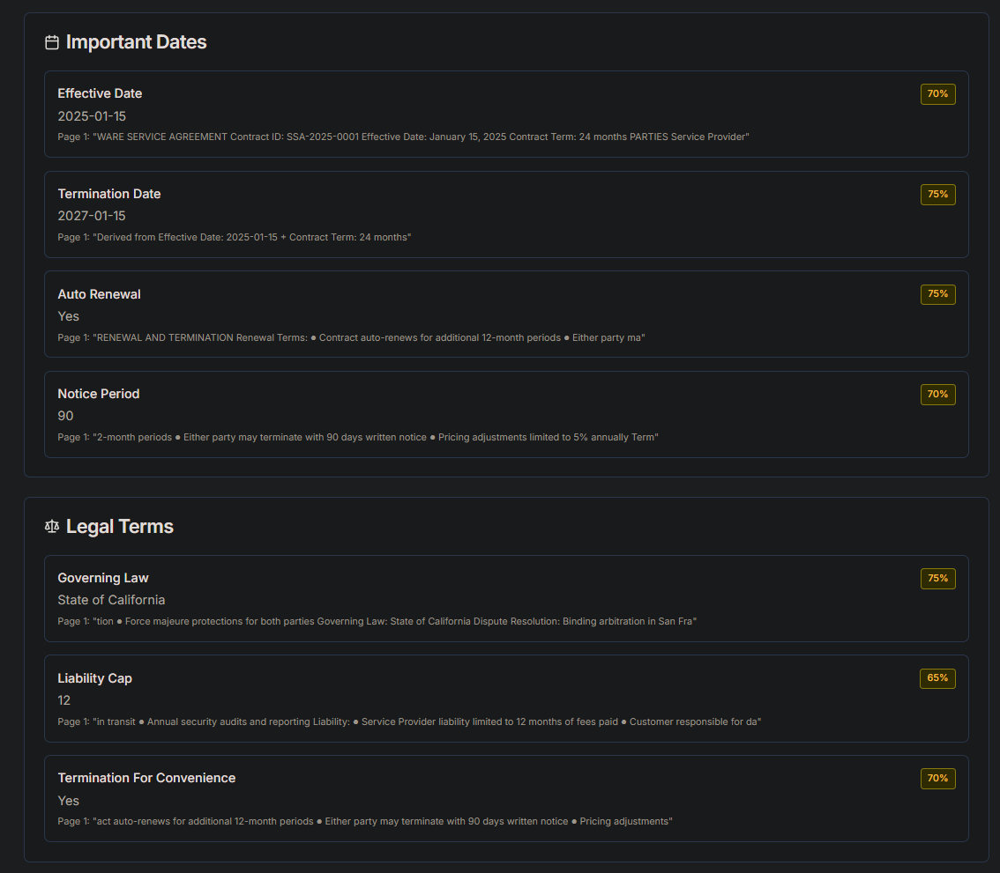
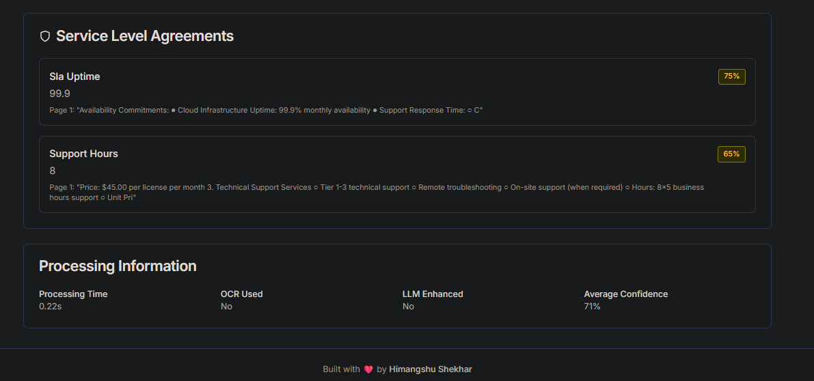
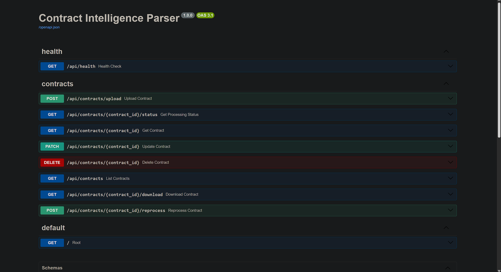

# Contract Intelligence Parser

[](https://fastapi.tiangolo.com/)
[](https://nextjs.org/)
[](https://www.mongodb.com/)
[](https://www.docker.com/)
[](https://www.python.org/)
[](https://www.typescriptlang.org/)

> **Intelligent Contract Analysis Platform** - Automatically extract, analyze, and score critical financial and legal terms from PDF contracts with advanced OCR, regex-based extraction, and optional LLM enhancement.

---

## Overview

Contract Intelligence Parser is a production-ready document processing system designed for accounts receivable platforms and legal teams. The system automatically processes PDF contracts, extracting critical financial and operational data with confidence scoring and gap analysis to accelerate contract review workflows.

**Key Value Propositions:**
- **Automated Extraction**: Extract 40+ critical contract fields including parties, dates, commercial terms, and legal clauses
- **Confidence Scoring**: Advanced multi-signal scoring system with evidence-based validation
- **Gap Detection**: Intelligent identification of missing critical information with severity assessment
- **OCR Support**: Seamless processing of both digital and scanned contracts
- **Scalable Architecture**: Dockerized microservices supporting concurrent document processing


*Main dashboard showing contract processing pipeline and analytics*

## 📁 Project Structure

```
contract_intelligence_parser/
│
├── 📂 backend/                       # FastAPI backend service
│   ├── app/                         # Main application code
│   │   ├── api/                     # API layer
│   │   │   ├── endpoints/           # API route definitions
│   │   │   │   ├── contracts.py    # Contract CRUD operations
│   │   │   │   ├── health.py       # Health check endpoint
│   │   │   │   └── __init__.py
│   │   │   ├── middleware/          # Custom middleware (CORS, auth, etc.)
│   │   │   └── __init__.py
│   │   ├── core/                    # Core configuration
│   │   │   ├── config.py           # Settings management
│   │   │   ├── database.py         # MongoDB connection setup
│   │   │   └── __init__.py
│   │   ├── models/                  # Data models
│   │   │   ├── contract.py         # Contract document schema
│   │   │   └── __init__.py
│   │   ├── services/                # Business logic
│   │   │   ├── background_processor.py  # Async processing
│   │   │   ├── contract_extractor.py    # Field extraction logic
│   │   │   ├── extraction_patterns.py   # Regex patterns library
│   │   │   ├── pdf_processor.py         # PDF/OCR processing
│   │   │   └── __init__.py
│   │   ├── utils/                   # Utility functions
│   │   ├── main.py                  # FastAPI application entry
│   │   └── __init__.py
│   ├── tests/                       # Backend test suite
│   │   ├── test_api_endpoints.py   # API route tests
│   │   ├── test_contract_extractor.py  # Extraction logic tests
│   │   ├── test_extraction_patterns.py # Pattern validation
│   │   └── __init__.py
│   ├── uploads/                     # Temporary file storage
│   ├── Dockerfile                   # Backend container definition
│   ├── requirements.txt             # Python dependencies
│   └── pytest.ini                   # Test configuration
│
├── 📂 frontend/                      # Next.js frontend application
│   ├── src/                         # Source code
│   │   ├── app/                     # Next.js app directory
│   │   │   ├── contracts/           # Contract pages
│   │   │   │   ├── [id]/           # Dynamic contract detail
│   │   │   │   │   └── page.tsx    # Contract detail view
│   │   │   │   └── page.tsx        # Contract list view
│   │   │   ├── layout.tsx          # Root layout
│   │   │   └── page.tsx            # Home/upload page
│   │   ├── components/              # React components
│   │   │   ├── ui/                 # Reusable UI components
│   │   │   │   ├── badge.tsx       # Status/confidence badges
│   │   │   │   ├── button.tsx      # Button component
│   │   │   │   ├── card.tsx        # Card layouts
│   │   │   │   └── progress.tsx    # Progress indicators
│   │   │   ├── file-upload.tsx     # File upload component
│   │   │   └── providers.tsx       # Context providers
│   │   ├── hooks/                   # Custom React hooks
│   │   ├── lib/                     # Utility libraries
│   │   │   ├── api.ts              # API client
│   │   │   └── utils.ts            # Helper functions
│   │   └── types/                   # TypeScript definitions
│   │       └── index.ts            # Type exports
│   ├── public/                      # Static assets
│   ├── Dockerfile                   # Frontend container definition
│   ├── next.config.js              # Next.js configuration
│   ├── package.json                # Node.js dependencies
│   ├── postcss.config.js           # PostCSS configuration
│   ├── tailwind.config.js          # Tailwind CSS configuration
│   └── tsconfig.json               # TypeScript configuration
│
├── 📂 docs/                          # Documentation assets
│   └── images/                      # Screenshots and diagrams
│
├── 🐳 Docker Configuration
│   ├── docker-compose.yml          # Main orchestration file
│   ├── docker-compose.override.yml # Development overrides
│   └── .env.example                # Environment template
│
├── 📚 Documentation
│   ├── README.md                   # This file
│   └── TROUBLESHOOTING.md         # Common issues & solutions
│
└── 🧪 Testing & Samples
    ├── test_sample_contract.py    # Integration test script
    └── sample_contract.pdf        # Example PDF for testing
```

### Directory Descriptions

#### Backend (`/backend`)
- **`app/api/`**: REST API endpoints for contract operations (upload, retrieve, update, delete)
- **`app/core/`**: Core application settings, database connections, and configuration
- **`app/models/`**: Pydantic models and MongoDB document schemas
- **`app/services/`**: Business logic including PDF processing, OCR, field extraction, and confidence scoring
- **`app/utils/`**: Shared utilities and helper functions
- **`tests/`**: Comprehensive test suite with unit and integration tests
- **`uploads/`**: Temporary storage for uploaded PDFs during processing

#### Frontend (`/frontend`)
- **`src/app/`**: Next.js 14 app router pages and layouts
- **`src/components/`**: Reusable React components and UI library
- **`src/hooks/`**: Custom React hooks for state management
- **`src/lib/`**: API client, utilities, and shared logic
- **`src/types/`**: TypeScript type definitions and interfaces

#### Infrastructure
- **Docker files**: Container definitions and orchestration for all services
- **Configuration**: Environment variables, database settings, and service configs
- **Documentation**: Comprehensive guides for setup, deployment, and troubleshooting

## ✨ Features

### 🔍 **Advanced Document Processing**
- **Multi-format Support**: Digital PDFs and scanned documents via OCR (Tesseract)
- **Intelligent Text Extraction**: PyMuPDF with coordinate preservation and page mapping
- **Robust Parsing**: 40+ field extraction with sophisticated regex patterns
- **Confidence Scoring**: Multi-signal confidence calculation (0.0-1.0) with evidence tracking

### 📊 **Smart Analytics & Scoring**
- **Weighted Scoring System**: Financial completeness (30%), Party identification (25%), Payment terms (20%), SLAs (15%), Contacts (10%)
- **Gap Analysis**: Automatic identification of missing critical fields with severity levels
- **Evidence Tracking**: Page-level source attribution for all extracted values
- **Processing Metrics**: Performance monitoring with duration and success tracking

### 🎯 **Extracted Field Categories**
- **Parties**: Company names, roles, signatories, contact information
- **Financial Terms**: Contract values, currencies, billing frequencies, payment terms
- **Dates**: Effective dates, termination dates, renewal terms, notice periods
- **Legal Clauses**: Governing law, liability caps, indemnification, IP ownership
- **Service Terms**: SLAs, performance metrics, support requirements

### 🔧 **Enterprise Features**
- **RESTful API**: Comprehensive FastAPI backend with OpenAPI documentation
- **Real-time Processing**: Asynchronous processing with status tracking
- **Data Persistence**: MongoDB with structured document storage
- **File Management**: Secure upload handling with hash-based deduplication
- **Error Recovery**: Graceful degradation and retry mechanisms


## 🏗️ Technology Stack

### Backend
- **FastAPI** 0.109.0 - High-performance Python web framework
- **Pydantic** 2.5.3 - Data validation and serialization
- **Beanie/Motor** - Async MongoDB ODM with Motor driver
- **PyMuPDF** 1.23.21 - PDF text extraction and analysis
- **OpenCV** + **Tesseract** - OCR processing for scanned documents
- **Celery** + **Redis** - Background task processing

### Frontend
- **Next.js** 14.1.0 - React framework with TypeScript
- **Tailwind CSS** - Utility-first styling framework
- **shadcn/ui** - Modern React component library
- **React Query** - Server state management and caching
- **React Hook Form** - Form handling and validation
- **Lucide React** - Icon library

### Infrastructure
- **Docker** + **docker-compose** - Containerized deployment
- **MongoDB** 4.0+ - Document database
- **Redis** - Caching and task queue
- **Nginx** (Production) - Reverse proxy and static serving



*Contract analysis results with confidence indicators and gap detection*

## 🚀 Quick Start

### Prerequisites
- Docker and Docker Compose
- Git

### Installation

1. **Clone the Repository first**

2. **Environment Setup**
   ```bash
   # Copy environment template
   cp .env.example .env

   # Edit environment variables as needed
   nano .env
   ```

3. **Start the Application**
   ```bash
   # Build and start all services
   docker-compose up --build

   # Or run in detached mode
   docker-compose up -d --build
   ```

4. **Verify Installation**
   ```bash
   # Check service status
   docker-compose ps

   # View logs
   docker-compose logs -f
   ```

### Access Points
- **Frontend Application**: http://localhost:3000
- **API Documentation**: http://localhost:8000/docs
- **MongoDB**: localhost:27017 (internal)
- **Redis**: localhost:6379 (internal)




*Detailed contract view with extracted fields, confidence scores, and evidence*

## 📋 Usage Examples

### API Usage

#### 1. Upload Contract
```bash
curl -X POST "http://localhost:8000/api/contracts" \
  -H "Content-Type: multipart/form-data" \
  -F "file=@sample_contract.pdf"
```

Response:
```json
{
  "id": "66f2a1b8e4b0c1234567890a",
  "filename": "sample_contract.pdf",
  "status": "processing",
  "message": "Contract uploaded successfully"
}
```

#### 2. Check Processing Status
```bash
curl "http://localhost:8000/api/contracts/66f2a1b8e4b0c1234567890a"
```

#### 3. Retrieve Extracted Data
```bash
curl "http://localhost:8000/api/contracts/66f2a1b8e4b0c1234567890a/fields"
```

### Frontend Workflow

1. **Upload**: Drag and drop PDF files or click to browse
2. **Monitor**: Real-time processing status with progress indicators
3. **Review**: Examine extracted fields with confidence indicators
4. **Validate**: Review gaps and low-confidence extractions
5. **Edit**: Manual corrections with evidence preservation
6. **Export**: Download processed data in multiple formats


*FastAPI automatic documentation with interactive endpoint testing*

## 🏛️ Architecture Overview

```
┌─────────────────┐    ┌──────────────────┐    ┌─────────────────┐
│   Frontend      │    │     Backend      │    │    Database     │
│   (Next.js)     │◄──►│    (FastAPI)     │◄──►│   (MongoDB)     │
│                 │    │                  │    │                 │
│ • Upload UI     │    │ • PDF Processing │    │ • Document      │
│ • Results View  │    │ • Text Extract   │    │   Storage       │
│ • Analytics     │    │ • Field Parse    │    │ • Metadata      │
└─────────────────┘    │ • Confidence     │    │ • Search Index  │
                       │   Scoring        │    └─────────────────┘
┌─────────────────┐    │ • Gap Detection  │    ┌─────────────────┐
│     Redis       │    │ • API Endpoints  │    │   File Storage  │
│   (Caching)     │◄──►│                  │◄──►│   (Local/S3)    │
│                 │    └──────────────────┘    │                 │
│ • Task Queue    │    ┌──────────────────┐    │ • PDF Files     │
│ • Session       │    │   OCR Engine     │    │ • Thumbnails    │
│ • Cache         │    │  (Tesseract)     │    │ • Temp Files    │
└─────────────────┘    └──────────────────┘    └─────────────────┘
```

### Processing Pipeline

1. **Ingestion**: PDF upload with validation and hash generation
2. **Text Extraction**: PyMuPDF for digital text, OCR fallback for scanned docs
3. **Field Extraction**: Regex-based pattern matching with 40+ field definitions
4. **Confidence Scoring**: Multi-signal algorithm with evidence weighting
5. **Gap Detection**: Missing field identification with severity assessment
6. **Storage**: MongoDB persistence with full-text search indexing
7. **Response**: Structured JSON with confidence metrics and evidence

## 🔧 Development

### Local Development Setup

1. **Backend Development**
   ```bash
   cd backend
   python -m venv venv
   source venv/bin/activate #venv\Scripts\activate
   pip install -r requirements.txt
   uvicorn app.main:app --reload --port 8000
   ```

2. **Frontend Development**
   ```bash
   cd frontend
   npm install
   npm run dev
   ```

3. **Database Setup**
   ```bash
   # Start MongoDB
   docker-compose up mongodb -d

   # Initialize database (optional)
   python backend/scripts/init_db.py
   ```

### Testing

```bash
# Backend tests
cd backend
pytest --cov=app tests/

# Frontend tests
cd frontend
npm test

# Integration tests
python test_sample_contract.py
```

### Code Quality

```bash
# Python linting
flake8 backend/
black backend/
mypy backend/

# TypeScript checking
cd frontend
npm run lint
npm run type-check
```


## 🛠️ Troubleshooting

For some issues I faced; to read, refer to [Troubleshooting Guide](./TROUBLESHOOTING.md).

### Quick Fixes

**Container Issues**:
```bash
# Reset Docker environment
docker-compose down -v
docker-compose up --build
```

**Database Connection**:
```bash
# Check MongoDB status
docker-compose logs mongodb

# Reset database
docker-compose down -v mongodb
docker-compose up mongodb -d
```
---

<div align="center">

**Built with ❤️ by [Himangshu Shekhar](https://github.com/dexterhimz)**

</div>